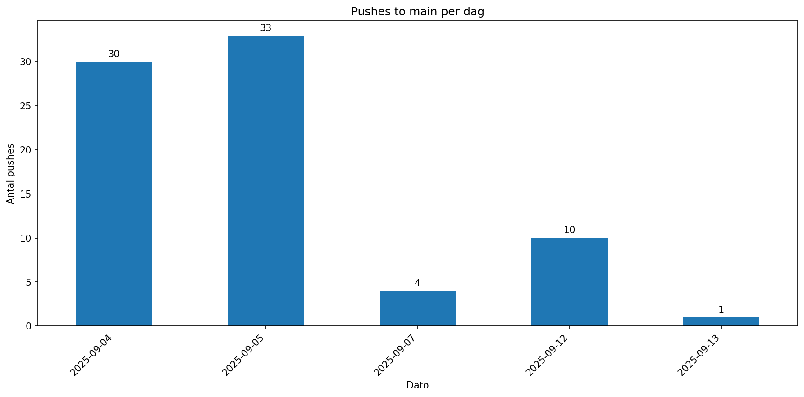
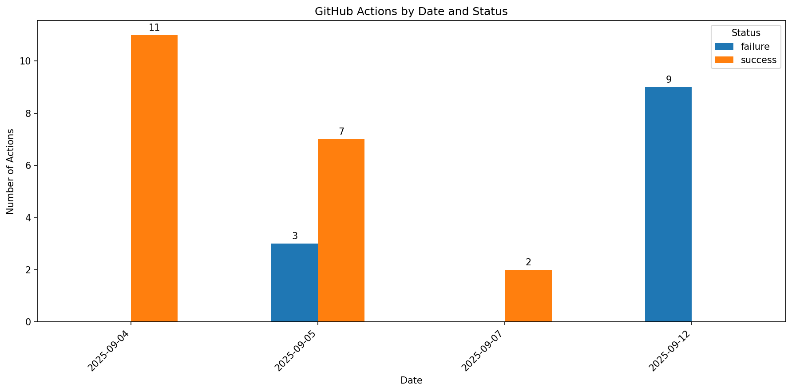

# Soft2-LargeSystemsDev-OLA2

## Group

- Oskar (Ossi-1337, cph-oo221)
- Peter (Peter537, cph-pa153)
- Yusuf (StylizedAce, cph-ya56)

## Video

Her er vores video præsentation: [https://youtu.be/nUEO56yEjfM](https://youtu.be/nUEO56yEjfM)

## About the Project

Dette er et template repository for hurtigt og effektivt at oprette et nyt projekt med en standardiseret struktur og konfiguration.

## Getting Started

- Clone: `git clone https://github.com/Peter537/Soft2-LargeSystemsDev-OLA2`

## Branching Strategy Decision

**Valg: GitHub Flow**

Vi kører en enkel branching strategy inspireret af GitHub Flow. Alt arbejde starter med et issue med purpose, scope og acceptance criteria. For hver task laver vi en short-lived branch fra `main`, arbejdet pushes i små increments, og når CI build og tests passerer, merges ændringen direkte til `main` uden formelt PR review. Kvalitet sikres via automation (formatting checks, tests, versioning), konsistente commit conventions og traceability ved at commits refererer issues (fx “Closes #12”). Transparens og overblik styrkes med auto labels og repository metrics. Hvis kompleksitet eller teamstørrelse vokser, kan vi skifte til required reviews og branch protection uden at ændre grundstrukturen, men lige nu giver simplicity + automation bedst balance mellem speed og kvalitet.

## Opt-out of pull requests

Vi har valgt at undlade PRs for at reducere process overhead og lead time. Flowet er bevidst streamlined, hvor et issue er en single source of truth, en short-lived branch implementerer løsningen, commits følger vores conventions og refererer issue number, og når CI validerer code, style og tests, merges branchen direkte til `main` og lukker issue via commit (“Closes #Issue-number”). I et low-complexity domain bliver PRs ofte mest formalia, men i stedet sikrer vi code quality automatisk med `.editorconfig`, formatting checks, tests og central dependency versioning, mens ensartethed sikres via issue templates. Modellen holder feedback loopet kort, bevarer transparency (metrics, issue history, commit trail) og gør det nemt senere at indføre stricter governance (branch protection, required review, approval rules), hvis risk profile eller størrelse ændrer sig. Kort sagt, så øger vi fart uden at gå på kompromis med kvalitet.

## Development container issues

Vi benytter os primært af Visual Studio, hvilket ikke understøtter dev-containere som Visual Studio Code gør.
Dog har vi fundet en workaround, som indebærer at bruge at bruge .editorconfig, global.json og Directory.Build.props til at sikre konsistens i udviklingsmiljøet.

.editorconfig er med til at sikre at alle udviklere følger de samme code formats.
global.json sikrer at alle udviklere bruger den samme version af .NET SDK.
Directory.Build.props kan bruges til at definere fælles MSBuild egenskaber og mål for alle projekter i repositoryet.

Ydligere ved at tilføje dette til vores CI workflow ([ci.yml](.github/workflows/ci.yml)):

```yml
- name: Verify formatting (.editorconfig)
  run: dotnet format --verify-no-changes
```

kan vi sikre at koden skal følge de regler der er beskrevet i .editorconfig filen.
Dette skaber en lidt lignende tilstand som dev-containere ville gøre.

## Automation & Workflow

Vi har opsat nogle forskellige GitHub Actions workflows for at automatisere vores udviklingsproces:

- **CI Workflow**: Dette workflow ([ci.yml](.github/workflows/ci.yml)) kører ved hver push til repositoryet. Det bygger og tester vores kode for at sikre at alt fungerer som forventet. Hvis builden eller testene fejler, vil vi blive notificeret, så vi kan rette problemerne hurtigt.

- **Metrics Workflows**: Vi har to ([GitHub Actions Metrics](.github/workflows/action-metrics.yml) & [Main Push Metrics](.github/workflows/push-metrics.yml)) forskellige workflows til at indsamle og opdatere metrics for vores repository. Disse workflows kører efter bestemte tidsplaner og opdaterer grafer, som hjælper os med at overvåge vores udviklingsaktivitet og workflow performance over tid.

- **Issue Labeler**: Dette workflow ([issue-labeler.yml](.github/workflows/issue-labeler.yml)) automatisk tilføjer labels til nye issues baseret på deres indhold. Det hjælper os med at organisere og prioritere issues mere effektivt.

Yderligere har vi lavet 2 issue templates for henholdsvis bugs ([bug_report](.github/ISSUE_TEMPLATE/bug_report.yml)) og feature ([feature_request](.github/ISSUE_TEMPLATE/feature_request.yml)) requests, for at hurtigtere at kunne lave nye issues og bug reports, men også at sikre en ensartet måde at lave dem på.

Ved ikk at bruge pull requests, at sikre at når et issue lukkes, så bliver det automatisk flyttet til done kolonnen i vores projekt board. Hvilket gørs ved at skrive "Closes #issue-number" i commit beskeden. For mere information, se [Commit Message Guidelines](CONTRIBUTING.md#3-commit-message-guidelines) for vores standard for commit beskeder.

## Metrics

Vi har 2 metrics i vores workflow. Det første er push metrics, som viser hvor mange commits der er blevet pushet til repositoryet over tid. Det er nyttigt for at se hvor aktivt
vores arbejde er på projektet. Det andet er action graph, som viser hvor mange gange vores GitHub Actions workflows er blevet kørt, samt deres succesrate. Det er nyttigt for at overvåge pålideligheden af vores automatiserede processer, som kan hjælpe med at identificere eventuelle problemer eller flaskehalse i vores udviklingsproces.

Nedenfor er eksempler på begge metrics:

**Push metrics**:


**Action graph**:


## License

Det her project bruger MIT License. Det er med til at sikre at koden kan bruges frit, men vi står ikke til ansvar, hvis noget går galt ved brugen af koden.
Se [LICENSE](LICENSE) for mere information.
